## 将第一节课实践的DCGAN代码改成lsgan的损失函数

可以看下有提示的地方。


```python
#导入一些必要的包
import os
import random
import paddle 
import paddle.nn as nn
import paddle.optimizer as optim
import paddle.vision.datasets as dset
import paddle.vision.transforms as transforms
import numpy as np
import matplotlib.pyplot as plt
import matplotlib.animation as animation
```

    /opt/conda/envs/python35-paddle120-env/lib/python3.7/site-packages/matplotlib/__init__.py:107: DeprecationWarning: Using or importing the ABCs from 'collections' instead of from 'collections.abc' is deprecated, and in 3.8 it will stop working
      from collections import MutableMapping
    /opt/conda/envs/python35-paddle120-env/lib/python3.7/site-packages/matplotlib/rcsetup.py:20: DeprecationWarning: Using or importing the ABCs from 'collections' instead of from 'collections.abc' is deprecated, and in 3.8 it will stop working
      from collections import Iterable, Mapping
    /opt/conda/envs/python35-paddle120-env/lib/python3.7/site-packages/matplotlib/colors.py:53: DeprecationWarning: Using or importing the ABCs from 'collections' instead of from 'collections.abc' is deprecated, and in 3.8 it will stop working
      from collections import Sized


```python
dataset = paddle.vision.datasets.MNIST(mode='train', 
                                        transform=transforms.Compose([
                                        # resize ->(32,32)
                                        transforms.Resize((32,32)),
                                        # 归一化到-1~1
                                        transforms.Normalize([127.5], [127.5])
                                    ]))

dataloader = paddle.io.DataLoader(dataset, batch_size=256,
                                  shuffle=True, num_workers=4)
```


```python
#参数初始化的模块
@paddle.no_grad()
def normal_(x, mean=0., std=1.):
    temp_value = paddle.normal(mean, std, shape=x.shape)
    x.set_value(temp_value)
    return x

@paddle.no_grad()
def uniform_(x, a=-1., b=1.):
    temp_value = paddle.uniform(min=a, max=b, shape=x.shape)
    x.set_value(temp_value)
    return x

@paddle.no_grad()
def constant_(x, value):
    temp_value = paddle.full(x.shape, value, x.dtype)
    x.set_value(temp_value)
    return x

def weights_init(m):
    classname = m.__class__.__name__
    if hasattr(m, 'weight') and classname.find('Conv') != -1:
        normal_(m.weight, 0.0, 0.02)
    elif classname.find('BatchNorm') != -1:
        normal_(m.weight, 1.0, 0.02)
        constant_(m.bias, 0)
```

## LSGAN


```python
# Generator Code
class Generator(nn.Layer):
    def __init__(self, ):
        super(Generator, self).__init__()
        self.gen = nn.Sequential(
            # input is Z, [B, 100, 1, 1] -> [B, 64 * 4, 4, 4]
            nn.Conv2DTranspose(100, 64 * 4, 4, 1, 0, bias_attr=False),
            nn.BatchNorm2D(64 * 4),
            nn.ReLU(True),
            # state size. [B, 64 * 4, 4, 4] -> [B, 64 * 2, 8, 8]
            nn.Conv2DTranspose(64 * 4, 64 * 2, 4, 2, 1, bias_attr=False),
            nn.BatchNorm2D(64 * 2),
            nn.ReLU(True),
            # state size. [B, 64 * 2, 8, 8] -> [B, 64, 16, 16]
            nn.Conv2DTranspose( 64 * 2, 64, 4, 2, 1, bias_attr=False),
            nn.BatchNorm2D(64),
            nn.ReLU(True),
            # state size. [B, 64, 16, 16] -> [B, 1, 32, 32]
            nn.Conv2DTranspose( 64, 1, 4, 2, 1, bias_attr=False),
            nn.Tanh()
        )

    def forward(self, x):
        return self.gen(x)


netG = Generator()
# Apply the weights_init function to randomly initialize all weights
#  to mean=0, stdev=0.2.
netG.apply(weights_init)

# Print the model
print(netG)
```

    Generator(
      (gen): Sequential(
        (0): Conv2DTranspose(100, 256, kernel_size=[4, 4], data_format=NCHW)
        (1): BatchNorm2D(num_features=256, momentum=0.9, epsilon=1e-05)
        (2): ReLU(name=True)
        (3): Conv2DTranspose(256, 128, kernel_size=[4, 4], stride=[2, 2], padding=1, data_format=NCHW)
        (4): BatchNorm2D(num_features=128, momentum=0.9, epsilon=1e-05)
        (5): ReLU(name=True)
        (6): Conv2DTranspose(128, 64, kernel_size=[4, 4], stride=[2, 2], padding=1, data_format=NCHW)
        (7): BatchNorm2D(num_features=64, momentum=0.9, epsilon=1e-05)
        (8): ReLU(name=True)
        (9): Conv2DTranspose(64, 1, kernel_size=[4, 4], stride=[2, 2], padding=1, data_format=NCHW)
        (10): Tanh()
      )
    )


```python
class Discriminator(nn.Layer):
    def __init__(self,):
        super(Discriminator, self).__init__()
        self.dis = nn.Sequential(
            # input [B, 1, 32, 32] -> [B, 64, 16, 16]
            nn.Conv2D(1, 64, 4, 2, 1, bias_attr=False),
            nn.LeakyReLU(0.2),

            # state size. [B, 64, 16, 16] -> [B, 128, 8, 8]
            nn.Conv2D(64, 64 * 2, 4, 2, 1, bias_attr=False),
            nn.BatchNorm2D(64 * 2),
            nn.LeakyReLU(0.2),

            # state size. [B, 128, 8, 8] -> [B, 256, 4, 4]
            nn.Conv2D(64 * 2, 64 * 4, 4, 2, 1, bias_attr=False),
            nn.BatchNorm2D(64 * 4),
            nn.LeakyReLU(0.2),

            # state size. [B, 256, 4, 4] -> [B, 1, 1, 1]
            nn.Conv2D(64 * 4, 1, 4, 1, 0, bias_attr=False),
            # 这里为需要改变的地方
            # nn.BatchNorm2D(256),
            # nn.LeakyReLU(0.2),
            # # state size. [B, 256, 1, 1] -> [B, 1]
            # nn.Linear(256, 1)
        )

    def forward(self, x):
        return self.dis(x)

netD = Discriminator()
netD.apply(weights_init)
print(netD)
```

    Discriminator(
      (dis): Sequential(
        (0): Conv2D(1, 64, kernel_size=[4, 4], stride=[2, 2], padding=1, data_format=NCHW)
        (1): LeakyReLU(negative_slope=0.2)
        (2): Conv2D(64, 128, kernel_size=[4, 4], stride=[2, 2], padding=1, data_format=NCHW)
        (3): BatchNorm2D(num_features=128, momentum=0.9, epsilon=1e-05)
        (4): LeakyReLU(negative_slope=0.2)
        (5): Conv2D(128, 256, kernel_size=[4, 4], stride=[2, 2], padding=1, data_format=NCHW)
        (6): BatchNorm2D(num_features=256, momentum=0.9, epsilon=1e-05)
        (7): LeakyReLU(negative_slope=0.2)
        (8): Conv2D(256, 1, kernel_size=[4, 4], data_format=NCHW)
      )
    )


```python
# Initialize BCELoss function
# 这里为需要改变的地方
loss = nn.MSELoss(reduction='mean')

# Create batch of latent vectors that we will use to visualize
#  the progression of the generator
fixed_noise = paddle.randn([32, 100, 1, 1], dtype='float32')

# Establish convention for real and fake labels during training
real_label = 1.
fake_label = 0.

# Setup Adam optimizers for both G and D
optimizerD = optim.Adam(parameters=netD.parameters(), learning_rate=0.0002, beta1=0.5, beta2=0.999)
optimizerG = optim.Adam(parameters=netG.parameters(), learning_rate=0.0002, beta1=0.5, beta2=0.999)

```


```python
losses = [[], []]
#plt.ion()
now = 0
epochs = 100
for pass_id in range(epochs):
    for batch_id, (data, target) in enumerate(dataloader):
        ############################
        # (1) Update D network: maximize log(D(x)) + log(1 - D(G(z)))
        ###########################

        optimizerD.clear_grad()
        real_img = data
        bs_size = real_img.shape[0]
        label = paddle.full((bs_size, 1, 1, 1), real_label, dtype='float32') # set 1
        real_out = netD(real_img)
        errD_real = loss(real_out, label)
        errD_real.backward()

        noise = paddle.randn([bs_size, 100, 1, 1], 'float32')
        fake_img = netG(noise)
        label = paddle.full((bs_size, 1, 1, 1), fake_label, dtype='float32')  # set 0
        fake_out = netD(fake_img.detach())
        errD_fake = loss(fake_out, label)
        errD_fake.backward()
        optimizerD.step()
        optimizerD.clear_grad()

        errD = 0.5 * errD_real + 0.5 * errD_fake
        losses[0].append(errD.numpy()[0])

        ############################
        # (2) Update G network: maximize log(D(G(z)))
        ###########################
        optimizerG.clear_grad()
        noise = paddle.randn([bs_size, 100, 1, 1],'float32')
        fake = netG(noise)
        label = paddle.full((bs_size, 1, 1, 1), real_label, dtype=np.float32) # set 1
        output = netD(fake)
        errG = 0.5 * loss(output,label)
        errG.backward()
        optimizerG.step()
        optimizerG.clear_grad()

        losses[1].append(errG.numpy()[0])


        ############################
        # visualize
        ###########################
        if batch_id % 200 == 0:
            generated_image = netG(noise).numpy()  # N C H W
            imgs = []
            plt.figure(figsize=(10, 10))
            try:
                for i in range(10):
                    image = generated_image[i].transpose()  # H W C
                    # image = np.where(image > 0, image, 0)   # ?生成器用了tanh又截取 而不用sigmoid 不理解为什么
                    image = image.transpose((1, 0, 2)) # H W C -> W H C
                    plt.subplot(10, 10, i + 1)
                    
                    plt.imshow(image[...,0], vmin=-1, vmax=1)
                    plt.axis('off')
                    plt.xticks([])
                    plt.yticks([])
                    plt.subplots_adjust(wspace=0.1, hspace=0.1)
                msg = 'Epoch ID={0} Batch ID={1} \n\n D-Loss={2} G-Loss={3}'.format(pass_id+1, batch_id, errD.numpy()[0], errG.numpy()[0])
                print(msg)
                plt.suptitle(msg, fontsize=20)
                plt.draw()
                plt.savefig('{}/{:04d}_{:04d}.png'.format('work', pass_id, batch_id), bbox_inches='tight')
                plt.pause(0.01)
            except IOError:
                print(IOError)
    paddle.save(netG.state_dict(), "work/generator.params")
```

    Epoch ID=1 Batch ID=0 
    
     D-Loss=1.9358999729156494 G-Loss=0.4397525489330292


    Epoch ID=1 Batch ID=200 
    
     D-Loss=0.14011457562446594 G-Loss=0.5309092402458191


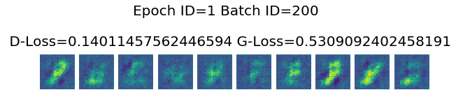


    Epoch ID=2 Batch ID=0 
    
     D-Loss=0.08318828791379929 G-Loss=0.5768296122550964


    Epoch ID=2 Batch ID=200 
    
     D-Loss=0.05095591023564339 G-Loss=0.2649965286254883


    Epoch ID=3 Batch ID=0 
    
     D-Loss=0.056007519364356995 G-Loss=0.5535615682601929


    Epoch ID=3 Batch ID=200 
    
     D-Loss=0.16651543974876404 G-Loss=0.2760796546936035


    Epoch ID=4 Batch ID=0 
    
     D-Loss=0.10240086913108826 G-Loss=0.3066198229789734


    Epoch ID=4 Batch ID=200 
    
     D-Loss=0.04027729481458664 G-Loss=0.46226999163627625


    Epoch ID=5 Batch ID=0 
    
     D-Loss=0.04875844717025757 G-Loss=0.4858550429344177


    Epoch ID=5 Batch ID=200 
    
     D-Loss=0.06634216010570526 G-Loss=0.37016624212265015


    Epoch ID=6 Batch ID=0 
    
     D-Loss=0.07013087719678879 G-Loss=0.5703140497207642


    Epoch ID=6 Batch ID=200 
    
     D-Loss=0.04941677302122116 G-Loss=0.4298223853111267


    Epoch ID=7 Batch ID=0 
    
     D-Loss=0.0657932236790657 G-Loss=0.6177952289581299


    Epoch ID=7 Batch ID=200 
    
     D-Loss=0.12208119034767151 G-Loss=0.25224268436431885


    Epoch ID=8 Batch ID=0 
    
     D-Loss=0.05166909843683243 G-Loss=0.3641071617603302


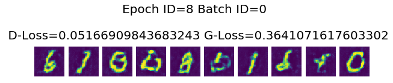


    Epoch ID=8 Batch ID=200 
    
     D-Loss=0.06245502829551697 G-Loss=0.35313963890075684


    Epoch ID=9 Batch ID=0 
    
     D-Loss=0.06263755261898041 G-Loss=0.48434412479400635


    Epoch ID=9 Batch ID=200 
    
     D-Loss=0.09722050279378891 G-Loss=0.30322062969207764


    Epoch ID=10 Batch ID=0 
    
     D-Loss=0.07305487245321274 G-Loss=0.3304668664932251


    Epoch ID=10 Batch ID=200 
    
     D-Loss=0.08700525015592575 G-Loss=0.32991454005241394


    Epoch ID=11 Batch ID=0 
    
     D-Loss=0.16245760023593903 G-Loss=0.07061893492937088


    Epoch ID=11 Batch ID=200 
    
     D-Loss=0.0819011852145195 G-Loss=0.342020183801651


    Epoch ID=12 Batch ID=0 
    
     D-Loss=0.11193335801362991 G-Loss=0.4040062427520752


    Epoch ID=12 Batch ID=200 
    
     D-Loss=0.14146685600280762 G-Loss=0.22948504984378815


    Epoch ID=13 Batch ID=0 
    
     D-Loss=0.1407606303691864 G-Loss=0.21904397010803223


    Epoch ID=13 Batch ID=200 
    
     D-Loss=0.14384600520133972 G-Loss=0.20803123712539673


    Epoch ID=14 Batch ID=0 
    
     D-Loss=0.1410936713218689 G-Loss=0.3481510281562805


    Epoch ID=14 Batch ID=200 
    
     D-Loss=0.09363558888435364 G-Loss=0.40402790904045105


    Epoch ID=15 Batch ID=0 
    
     D-Loss=0.13204115629196167 G-Loss=0.20727597177028656


    Epoch ID=15 Batch ID=200 
    
     D-Loss=0.1333109736442566 G-Loss=0.40094128251075745


    Epoch ID=16 Batch ID=0 
    
     D-Loss=0.07008375227451324 G-Loss=0.23720017075538635


    Epoch ID=16 Batch ID=200 
    
     D-Loss=0.06598413735628128 G-Loss=0.3849075436592102


    Epoch ID=17 Batch ID=0 
    
     D-Loss=0.12807004153728485 G-Loss=0.5222793817520142


    Epoch ID=17 Batch ID=200 
    
     D-Loss=0.11763454973697662 G-Loss=0.31442397832870483


    Epoch ID=18 Batch ID=0 
    
     D-Loss=0.09341304749250412 G-Loss=0.28636062145233154


    Epoch ID=18 Batch ID=200 
    
     D-Loss=0.1240253895521164 G-Loss=0.478136271238327


    Epoch ID=19 Batch ID=0 
    
     D-Loss=0.10306382179260254 G-Loss=0.32745546102523804


    Epoch ID=19 Batch ID=200 
    
     D-Loss=0.09123299270868301 G-Loss=0.275331974029541


    Epoch ID=20 Batch ID=0 
    
     D-Loss=0.08526082336902618 G-Loss=0.3030626177787781


    Epoch ID=20 Batch ID=200 
    
     D-Loss=0.08270453661680222 G-Loss=0.3835517466068268


    Epoch ID=21 Batch ID=0 
    
     D-Loss=0.24839378893375397 G-Loss=0.03984356299042702


    Epoch ID=21 Batch ID=200 
    
     D-Loss=0.12763184309005737 G-Loss=0.3032982349395752


    Epoch ID=22 Batch ID=0 
    
     D-Loss=0.08393190056085587 G-Loss=0.46028125286102295


    Epoch ID=22 Batch ID=200 
    
     D-Loss=0.18204379081726074 G-Loss=0.7845019102096558


    Epoch ID=23 Batch ID=0 
    
     D-Loss=0.08186294883489609 G-Loss=0.22363737225532532


    Epoch ID=23 Batch ID=200 
    
     D-Loss=0.0676991268992424 G-Loss=0.29139235615730286


    Epoch ID=24 Batch ID=0 
    
     D-Loss=0.07445225119590759 G-Loss=0.24321064352989197


    Epoch ID=24 Batch ID=200 
    
     D-Loss=0.08614002913236618 G-Loss=0.5474581122398376


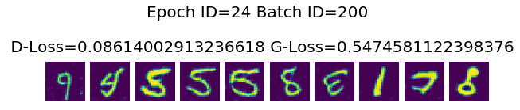


    Epoch ID=25 Batch ID=0 
    
     D-Loss=0.1299048811197281 G-Loss=0.6094257831573486


    Epoch ID=25 Batch ID=200 
    
     D-Loss=0.06896286457777023 G-Loss=0.3311704993247986


    Epoch ID=26 Batch ID=0 
    
     D-Loss=0.04075194150209427 G-Loss=0.42883554100990295


    Epoch ID=26 Batch ID=200 
    
     D-Loss=0.03546310216188431 G-Loss=0.5567054748535156


    Epoch ID=27 Batch ID=0 
    
     D-Loss=0.03217652067542076 G-Loss=0.5413481593132019


    Epoch ID=27 Batch ID=200 
    
     D-Loss=0.14083488285541534 G-Loss=0.5360519289970398


    Epoch ID=28 Batch ID=0 
    
     D-Loss=0.23782791197299957 G-Loss=0.5572793483734131


    Epoch ID=28 Batch ID=200 
    
     D-Loss=0.032802361994981766 G-Loss=0.5766098499298096


    Epoch ID=29 Batch ID=0 
    
     D-Loss=0.04188483953475952 G-Loss=0.4513552784919739


    Epoch ID=29 Batch ID=200 
    
     D-Loss=0.018980396911501884 G-Loss=0.5372178554534912


    Epoch ID=30 Batch ID=0 
    
     D-Loss=0.033416472375392914 G-Loss=0.5616002678871155


    Epoch ID=30 Batch ID=200 
    
     D-Loss=0.034037716686725616 G-Loss=0.45366817712783813


    Epoch ID=31 Batch ID=0 
    
     D-Loss=0.06616193801164627 G-Loss=0.6179721355438232


    Epoch ID=31 Batch ID=200 
    
     D-Loss=0.018991095945239067 G-Loss=0.38347187638282776


    Epoch ID=32 Batch ID=0 
    
     D-Loss=0.03590890392661095 G-Loss=0.4349137842655182


    Epoch ID=32 Batch ID=200 
    
     D-Loss=0.018221667036414146 G-Loss=0.45934271812438965


    Epoch ID=33 Batch ID=0 
    
     D-Loss=0.03594384714961052 G-Loss=0.6656414866447449


    Epoch ID=33 Batch ID=200 
    
     D-Loss=0.023090824484825134 G-Loss=0.5072858929634094


    Epoch ID=34 Batch ID=0 
    
     D-Loss=0.027561450377106667 G-Loss=0.5276408195495605


    Epoch ID=34 Batch ID=200 
    
     D-Loss=0.014042315073311329 G-Loss=0.45030951499938965


    Epoch ID=35 Batch ID=0 
    
     D-Loss=0.53480064868927 G-Loss=0.4174194037914276


    Epoch ID=35 Batch ID=200 
    
     D-Loss=0.02156827598810196 G-Loss=0.5660157203674316


    Epoch ID=36 Batch ID=0 
    
     D-Loss=0.05239243805408478 G-Loss=0.35601192712783813


    Epoch ID=36 Batch ID=200 
    
     D-Loss=0.1254400610923767 G-Loss=0.18204446136951447


    Epoch ID=37 Batch ID=0 
    
     D-Loss=0.03092839941382408 G-Loss=0.553573727607727


    Epoch ID=37 Batch ID=200 
    
     D-Loss=0.04508724808692932 G-Loss=0.3541739583015442


    Epoch ID=38 Batch ID=0 
    
     D-Loss=0.01759999990463257 G-Loss=0.39668557047843933


    Epoch ID=38 Batch ID=200 
    
     D-Loss=0.01126034278422594 G-Loss=0.5406288504600525


    Epoch ID=39 Batch ID=0 
    
     D-Loss=0.14202409982681274 G-Loss=0.24805854260921478


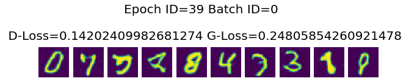


    Epoch ID=39 Batch ID=200 
    
     D-Loss=0.051506996154785156 G-Loss=0.4415804445743561


    Epoch ID=40 Batch ID=0 
    
     D-Loss=0.02312622405588627 G-Loss=0.40217265486717224


    Epoch ID=40 Batch ID=200 
    
     D-Loss=0.12150440365076065 G-Loss=0.358845591545105


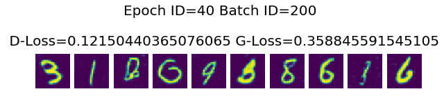


    Epoch ID=41 Batch ID=0 
    
     D-Loss=0.012109722942113876 G-Loss=0.4883597493171692


    Epoch ID=41 Batch ID=200 
    
     D-Loss=0.01236964762210846 G-Loss=0.45272180438041687


    Epoch ID=42 Batch ID=0 
    
     D-Loss=0.03434368968009949 G-Loss=0.38126999139785767


    Epoch ID=42 Batch ID=200 
    
     D-Loss=0.028646770864725113 G-Loss=0.4319068491458893


    Epoch ID=43 Batch ID=0 
    
     D-Loss=0.040046561509370804 G-Loss=0.30067142844200134


    Epoch ID=43 Batch ID=200 
    
     D-Loss=0.014283208176493645 G-Loss=0.4916715621948242


    Epoch ID=44 Batch ID=0 
    
     D-Loss=0.043321214616298676 G-Loss=0.5637978315353394


    Epoch ID=44 Batch ID=200 
    
     D-Loss=0.01891147717833519 G-Loss=0.42210039496421814


    Epoch ID=45 Batch ID=0 
    
     D-Loss=0.033087506890296936 G-Loss=0.3949100375175476


    Epoch ID=45 Batch ID=200 
    
     D-Loss=0.017312362790107727 G-Loss=0.532122015953064


    Epoch ID=46 Batch ID=0 
    
     D-Loss=0.03380369767546654 G-Loss=0.44601812958717346


    Epoch ID=46 Batch ID=200 
    
     D-Loss=0.14455175399780273 G-Loss=0.26798319816589355


    Epoch ID=47 Batch ID=0 
    
     D-Loss=0.03448718041181564 G-Loss=0.43428459763526917


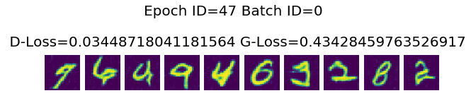


    Epoch ID=47 Batch ID=200 
    
     D-Loss=0.020372087135910988 G-Loss=0.38851702213287354


    Epoch ID=48 Batch ID=0 
    
     D-Loss=0.034692615270614624 G-Loss=0.3830767869949341


    Epoch ID=48 Batch ID=200 
    
     D-Loss=0.013386985287070274 G-Loss=0.49480679631233215


    Epoch ID=49 Batch ID=0 
    
     D-Loss=0.03152847662568092 G-Loss=0.39540737867355347


    Epoch ID=49 Batch ID=200 
    
     D-Loss=0.04604679346084595 G-Loss=0.4395075738430023


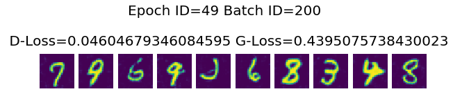


    Epoch ID=50 Batch ID=0 
    
     D-Loss=0.010768365114927292 G-Loss=0.4710789620876312


    Epoch ID=50 Batch ID=200 
    
     D-Loss=0.04687187820672989 G-Loss=0.5388808250427246


    Epoch ID=51 Batch ID=0 
    
     D-Loss=0.01640937104821205 G-Loss=0.4570675790309906


    Epoch ID=51 Batch ID=200 
    
     D-Loss=0.007521261926740408 G-Loss=0.5127817392349243


    Epoch ID=52 Batch ID=0 
    
     D-Loss=0.009638838469982147 G-Loss=0.5628988146781921


    Epoch ID=52 Batch ID=200 
    
     D-Loss=0.1559613049030304 G-Loss=0.22937297821044922


    Epoch ID=53 Batch ID=0 
    
     D-Loss=0.010718435049057007 G-Loss=0.46601757407188416


    Epoch ID=53 Batch ID=200 
    
     D-Loss=0.01701526716351509 G-Loss=0.5642077326774597


    Epoch ID=54 Batch ID=0 
    
     D-Loss=0.013741908594965935 G-Loss=0.5463123917579651


    Epoch ID=54 Batch ID=200 
    
     D-Loss=0.2041378617286682 G-Loss=0.913519561290741


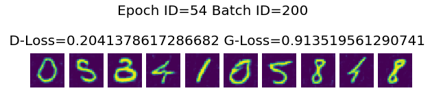


    Epoch ID=55 Batch ID=0 
    
     D-Loss=0.014377165585756302 G-Loss=0.4521406590938568


    Epoch ID=55 Batch ID=200 
    
     D-Loss=0.01921449974179268 G-Loss=0.647456169128418


    Epoch ID=56 Batch ID=0 
    
     D-Loss=0.014359314925968647 G-Loss=0.4439166188240051


    Epoch ID=56 Batch ID=200 
    
     D-Loss=0.03800737112760544 G-Loss=0.482934832572937


    Epoch ID=57 Batch ID=0 
    
     D-Loss=0.022446375340223312 G-Loss=0.3803800046443939


    Epoch ID=57 Batch ID=200 
    
     D-Loss=0.010543134063482285 G-Loss=0.4504256844520569


    Epoch ID=58 Batch ID=0 
    
     D-Loss=0.009165606461465359 G-Loss=0.5118986368179321


    Epoch ID=58 Batch ID=200 
    
     D-Loss=0.2139129340648651 G-Loss=0.08673737198114395


    Epoch ID=59 Batch ID=0 
    
     D-Loss=0.026426944881677628 G-Loss=0.3183555006980896


    Epoch ID=59 Batch ID=200 
    
     D-Loss=0.010853467509150505 G-Loss=0.506156325340271


    Epoch ID=60 Batch ID=0 
    
     D-Loss=0.012076104059815407 G-Loss=0.544084906578064


    Epoch ID=60 Batch ID=200 
    
     D-Loss=0.009974794462323189 G-Loss=0.5117498636245728


    Epoch ID=61 Batch ID=0 
    
     D-Loss=0.016369672492146492 G-Loss=0.3860127925872803


    Epoch ID=61 Batch ID=200 
    
     D-Loss=0.01673722267150879 G-Loss=0.38732659816741943


    Epoch ID=62 Batch ID=0 
    
     D-Loss=0.017186854034662247 G-Loss=0.4323083162307739


    Epoch ID=62 Batch ID=200 
    
     D-Loss=0.11228826642036438 G-Loss=0.2907510995864868


    Epoch ID=63 Batch ID=0 
    
     D-Loss=0.060189388692379 G-Loss=0.790605902671814


    Epoch ID=63 Batch ID=200 
    
     D-Loss=0.036751143634319305 G-Loss=0.4436638653278351


    Epoch ID=64 Batch ID=0 
    
     D-Loss=0.008931487798690796 G-Loss=0.5022826790809631


    Epoch ID=64 Batch ID=200 
    
     D-Loss=0.007846126332879066 G-Loss=0.5235300064086914


    Epoch ID=65 Batch ID=0 
    
     D-Loss=0.0063721416518092155 G-Loss=0.526885986328125


    Epoch ID=65 Batch ID=200 
    
     D-Loss=0.01565375179052353 G-Loss=0.41385409235954285


    Epoch ID=66 Batch ID=0 
    
     D-Loss=0.012989304959774017 G-Loss=0.4242229461669922


    Epoch ID=66 Batch ID=200 
    
     D-Loss=0.007758762687444687 G-Loss=0.5469778776168823


    Epoch ID=67 Batch ID=0 
    
     D-Loss=0.0771908089518547 G-Loss=0.29851001501083374


    Epoch ID=67 Batch ID=200 
    
     D-Loss=0.13029661774635315 G-Loss=0.19846098124980927


    Epoch ID=68 Batch ID=0 
    
     D-Loss=0.01154412142932415 G-Loss=0.4258694350719452


    Epoch ID=68 Batch ID=200 
    
     D-Loss=0.006425852421671152 G-Loss=0.5101633071899414


    Epoch ID=69 Batch ID=0 
    
     D-Loss=0.03473221883177757 G-Loss=0.3856547474861145


    Epoch ID=69 Batch ID=200 
    
     D-Loss=0.007608711253851652 G-Loss=0.473611980676651


    Epoch ID=70 Batch ID=0 
    
     D-Loss=0.1238086074590683 G-Loss=0.48085257411003113


    Epoch ID=70 Batch ID=200 
    
     D-Loss=0.01096801832318306 G-Loss=0.42398083209991455


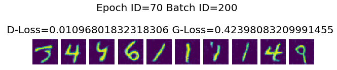


    Epoch ID=71 Batch ID=0 
    
     D-Loss=0.005917430855333805 G-Loss=0.5614656209945679


    Epoch ID=71 Batch ID=200 
    
     D-Loss=0.011774295940995216 G-Loss=0.4170302748680115


    Epoch ID=72 Batch ID=0 
    
     D-Loss=0.027708636596798897 G-Loss=0.38781529664993286


    Epoch ID=72 Batch ID=200 
    
     D-Loss=0.023786641657352448 G-Loss=0.5954102277755737


    Epoch ID=73 Batch ID=0 
    
     D-Loss=0.008372233249247074 G-Loss=0.4479081928730011


    Epoch ID=73 Batch ID=200 
    
     D-Loss=0.013842122629284859 G-Loss=0.5563865900039673


    Epoch ID=74 Batch ID=0 
    
     D-Loss=0.013145255856215954 G-Loss=0.5482329726219177


    Epoch ID=74 Batch ID=200 
    
     D-Loss=0.00926220417022705 G-Loss=0.5574415922164917


    Epoch ID=75 Batch ID=0 
    
     D-Loss=0.009603610262274742 G-Loss=0.4005301892757416


    Epoch ID=75 Batch ID=200 
    
     D-Loss=0.005898855626583099 G-Loss=0.4715716242790222


    Epoch ID=76 Batch ID=0 
    
     D-Loss=0.21557419002056122 G-Loss=0.39369964599609375


    Epoch ID=76 Batch ID=200 
    
     D-Loss=0.007602950092405081 G-Loss=0.5532082319259644


    Epoch ID=77 Batch ID=0 
    
     D-Loss=0.1092258170247078 G-Loss=0.45359522104263306


    Epoch ID=77 Batch ID=200 
    
     D-Loss=0.009401237592101097 G-Loss=0.49932122230529785


    Epoch ID=78 Batch ID=0 
    
     D-Loss=0.010312078520655632 G-Loss=0.46986013650894165


    Epoch ID=78 Batch ID=200 
    
     D-Loss=0.010720296762883663 G-Loss=0.5455833673477173


    Epoch ID=79 Batch ID=0 
    
     D-Loss=0.01427130214869976 G-Loss=0.4036540985107422


    Epoch ID=79 Batch ID=200 
    
     D-Loss=0.005651852115988731 G-Loss=0.5055004954338074


    Epoch ID=80 Batch ID=0 
    
     D-Loss=0.006604163907468319 G-Loss=0.4804970622062683


    Epoch ID=80 Batch ID=200 
    
     D-Loss=0.028488360345363617 G-Loss=0.5543793439865112


    Epoch ID=81 Batch ID=0 
    
     D-Loss=0.019863558933138847 G-Loss=0.6208798289299011


    Epoch ID=81 Batch ID=200 
    
     D-Loss=0.006665701046586037 G-Loss=0.5105370283126831


    Epoch ID=82 Batch ID=0 
    
     D-Loss=0.0076598189771175385 G-Loss=0.4946480393409729


    Epoch ID=82 Batch ID=200 
    
     D-Loss=0.011170824058353901 G-Loss=0.5721086263656616


    Epoch ID=83 Batch ID=0 
    
     D-Loss=0.007454773411154747 G-Loss=0.41398823261260986


    Epoch ID=83 Batch ID=200 
    
     D-Loss=0.00494527630507946 G-Loss=0.5196314454078674


    Epoch ID=84 Batch ID=0 
    
     D-Loss=0.012756227515637875 G-Loss=0.5486763715744019


    Epoch ID=84 Batch ID=200 
    
     D-Loss=0.022273238748311996 G-Loss=0.5411897897720337


    Epoch ID=85 Batch ID=0 
    
     D-Loss=0.011252586729824543 G-Loss=0.5125386118888855


    Epoch ID=85 Batch ID=200 
    
     D-Loss=0.05227791145443916 G-Loss=0.607224702835083


    Epoch ID=86 Batch ID=0 
    
     D-Loss=0.009166798554360867 G-Loss=0.50929194688797


    Epoch ID=86 Batch ID=200 
    
     D-Loss=0.005937656387686729 G-Loss=0.4788573980331421


    Epoch ID=87 Batch ID=0 
    
     D-Loss=0.06022780388593674 G-Loss=0.404261976480484


    Epoch ID=87 Batch ID=200 
    
     D-Loss=0.010493636131286621 G-Loss=0.5392003059387207


    Epoch ID=88 Batch ID=0 
    
     D-Loss=0.031628064811229706 G-Loss=0.4006202220916748


    Epoch ID=88 Batch ID=200 
    
     D-Loss=0.013105817139148712 G-Loss=0.5251455307006836


    Epoch ID=89 Batch ID=0 
    
     D-Loss=0.018097255378961563 G-Loss=0.48234593868255615


    Epoch ID=89 Batch ID=200 
    
     D-Loss=0.009589442983269691 G-Loss=0.47861728072166443


    Epoch ID=90 Batch ID=0 
    
     D-Loss=0.007263148203492165 G-Loss=0.5578843951225281


    Epoch ID=90 Batch ID=200 
    
     D-Loss=0.010009286925196648 G-Loss=0.5326584577560425


    Epoch ID=91 Batch ID=0 
    
     D-Loss=0.008102464489638805 G-Loss=0.48788243532180786


    Epoch ID=91 Batch ID=200 
    
     D-Loss=0.005878766067326069 G-Loss=0.47081199288368225


    Epoch ID=92 Batch ID=0 
    
     D-Loss=0.009851999580860138 G-Loss=0.5911814570426941


    Epoch ID=92 Batch ID=200 
    
     D-Loss=0.011832792311906815 G-Loss=0.5104879140853882


    Epoch ID=93 Batch ID=0 
    
     D-Loss=0.014141878113150597 G-Loss=0.4497504234313965


    Epoch ID=93 Batch ID=200 
    
     D-Loss=0.008552350103855133 G-Loss=0.49985092878341675


    Epoch ID=94 Batch ID=0 
    
     D-Loss=0.010632784105837345 G-Loss=0.5436207056045532


    Epoch ID=94 Batch ID=200 
    
     D-Loss=0.015277950093150139 G-Loss=0.4581977128982544


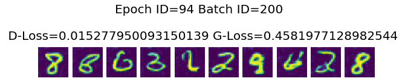


    Epoch ID=95 Batch ID=0 
    
     D-Loss=0.006789944134652615 G-Loss=0.5109097957611084


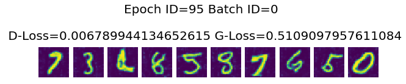


    Epoch ID=95 Batch ID=200 
    
     D-Loss=0.01030987873673439 G-Loss=0.4585127830505371


    Epoch ID=96 Batch ID=0 
    
     D-Loss=0.020665869116783142 G-Loss=0.5683664083480835


    Epoch ID=96 Batch ID=200 
    
     D-Loss=0.0052238767966628075 G-Loss=0.47285908460617065


    Epoch ID=97 Batch ID=0 
    
     D-Loss=0.008773834444582462 G-Loss=0.5102346539497375


    Epoch ID=97 Batch ID=200 
    
     D-Loss=0.004522057715803385 G-Loss=0.4133334457874298


    Epoch ID=98 Batch ID=0 
    
     D-Loss=0.004490025341510773 G-Loss=0.4740501046180725


    Epoch ID=98 Batch ID=200 
    
     D-Loss=0.010032260790467262 G-Loss=0.4623270332813263


    Epoch ID=99 Batch ID=0 
    
     D-Loss=0.006423374637961388 G-Loss=0.50047367811203


    Epoch ID=99 Batch ID=200 
    
     D-Loss=0.007795094046741724 G-Loss=0.428654283285141


    Epoch ID=100 Batch ID=0 
    
     D-Loss=0.05036166310310364 G-Loss=0.4155038297176361


    Epoch ID=100 Batch ID=200 
    
     D-Loss=0.010250557214021683 G-Loss=0.5495871305465698


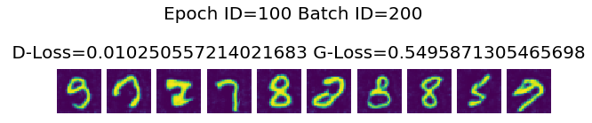


请点击[此处](https://ai.baidu.com/docs#/AIStudio_Project_Notebook/a38e5576)查看本环境基本用法.  <br>
Please click [here ](https://ai.baidu.com/docs#/AIStudio_Project_Notebook/a38e5576) for more detailed instructions. 


```python

```
